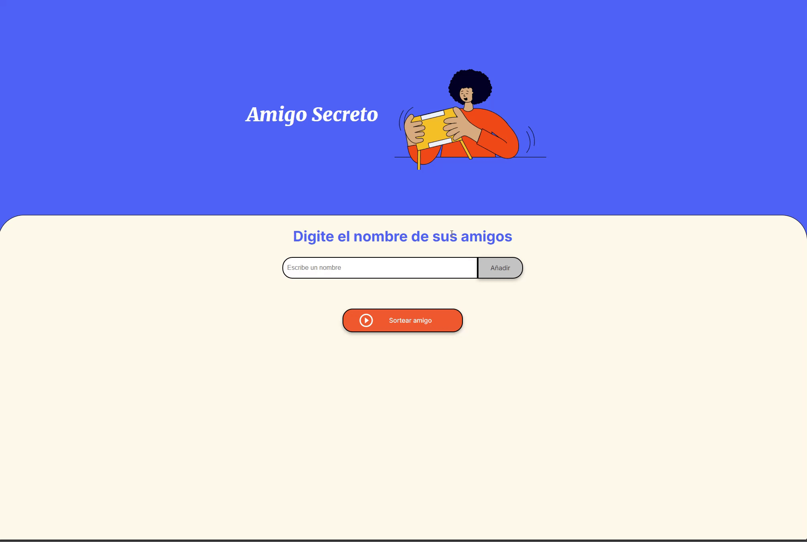

# 🎁 Amigo Secreto

Este proyecto es una aplicación web que permite agregar nombres a una lista y realizar un sorteo aleatorio para elegir un "amigo secreto".

## 🚀 Funcionalidades

- Agregar nombres a la lista de participantes.
- Validar que el campo de entrada no esté vacío.
- Mostrar una alerta si se intenta agregar un nombre vacío.
- Realizar un sorteo aleatorio entre los participantes.
- Limpiar la lista de amigos después del sorteo.

## 🎥 Demostración

A continuación, una vista previa del funcionamiento del programa:



## 📝 Instrucciones de uso

1. Ingresa los nombres de los amigos en el campo de texto.
2. Haz clic en "Añadir" para añadirlo al sorteo.
3. Haz clic en "Sortear amigo" para elegir aleatoriamente un amigo secreto.
4. Los resultados se mostrarán en la pantalla.

## 🛠️ Tecnologías utilizadas

- HTML
- CSS
- JavaScript

## ⚙️ Instalación

1. Clona el repositorio:
    ```bash
    git clone https://github.com/AnDev-000/challenge-amigo-secreto.git
    ```
2. Abre el proyecto en tu editor de código preferido (por ejemplo, Visual Studio Code).
3. Abre el archivo `index.html` en tu navegador para ver la aplicación en acción.


## ⚠️ Problemas comunes y soluciones

- **Problema**: No aparece la lista después de agregar un amigo.
  - **Solución**: Asegúrate de que el campo de texto no esté vacío al agregar un nombre.


## 👥 Contribuciones

Si deseas contribuir a este proyecto, por favor sigue estos pasos:
1. Haz un fork del repositorio.
2. Crea una nueva rama (`git checkout -b nueva-rama`).
3. Realiza tus cambios y haz un commit (`git commit -am 'Añadir nueva funcionalidad'`).
4. Haz push a tu rama (`git push origin nueva-rama`).
5. Crea un pull request en GitHub.

## 📜 Licencia

Este proyecto fue desarrollado como parte del curso Oracle One next education sobre desarrollo web y está disponible para uso educativo.  

Está bajo la licencia MIT, lo que permite su uso, modificación y distribución. Consulta el archivo [LICENSE](LICENSE) para más detalles.


## 👨‍💻 Autor

AnDev

## 🌐 Ver la aplicación en acción

Puedes ver la aplicación desplegada en línea a través de GitHub Pages en el siguiente enlace:

👉 [Ver la aplicación en acción](https://AnDev-000.github.io/challenge-amigo-secreto/)


## 📜 Certificación

> Este proyecto corresponde a la conclusión del curso "Practicando lógica de programación: Challenge amigo secreto", de "Oracle One Next Education / Alura Latam". El certificado que valida la finalización exitosa del curso se encuentra en: [`certificado/`](certificado/).